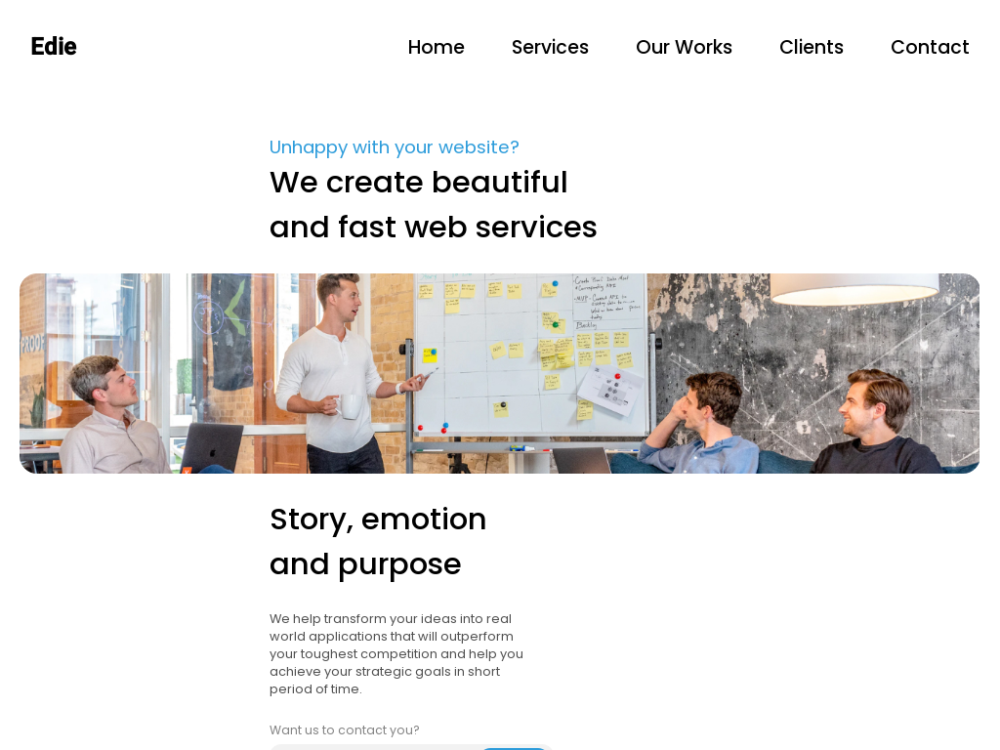

<!-- Please update value in the {}  -->

<h1 align="center">Edie Homepage</h1>

<div align="center">
   Solution for a challenge from  <a href="http://devchallenges.io" target="_blank">Devchallenges.io</a>.
</div>

<div align="center">
  <h3>
    <a href="https://david-dkp.github.io/Edie-homepage/">
      Demo
    </a>
    <span> | </span>
    <a href="https://devchallenges.io/solutions/BXZp8SuDJmkwzD8I0fEl">
      Solution
    </a>
    <span> | </span>
    <a href="https://devchallenges.io/challenges/xobQBuf8zWWmiYMIAZe0">
      Challenge
    </a>
  </h3>
</div>

<!-- TABLE OF CONTENTS -->

## Table of Contents

-   [Overview](#overview)
    -   [Built With](#built-with)
-   [Features](#features)
-   [How to use](#how-to-use)
-   [Contact](#contact)
-   [Acknowledgements](#acknowledgements)

<!-- OVERVIEW -->

## Overview



-   Where can I see your demo? Here :D : https://david-dkp.github.io/Edie-homepage/
-   What was your experience?  
    It was really fun to integrate a good-looking website. I'm starting to be comfortable at integrating :D
-   What have you learned/improved?
    I improved my responsiveness skills, and I learned a little more about CSS Grod :)
-   Your wisdom? :)

### Built With

<!-- This section should list any major frameworks that you built your project using. Here are a few examples.-->

-   HTML
-   CSS
-   JavaScript
-   [AOS](https://michalsnik.github.io/aos/)

## Features

<!-- List the features of your application or follow the template. Don't share the figma file here :) -->

This application/site was created as a submission to a [DevChallenges](https://devchallenges.io/challenges) challenge. The [challenge](https://devchallenges.io/challenges/xobQBuf8zWWmiYMIAZe0) was to build an application to complete the given user stories.

-   User story: I can see a page following the given design
-   User story: I can see a page on mobile following the given design
-   User story: I can go to certain locations by selecting links in navigation or footer

## How To Use

<!-- Example: -->

To clone and run this application, you'll need [Git](https://git-scm.com) and [Node.js](https://nodejs.org/en/download/) (which comes with [npm](http://npmjs.com)) installed on your computer. From your command line:

```bash
# Clone this repository
$ git clone https://github.com/david-dkp/Edie-homepage

```

Then open the index.html file

## Contact

-   Website [dekeuwerdavid.fr](https://dekeuwerdavid.fr)
-   GitHub [@david-dkp](https://github.com/david-dkp)
-   LinkedIn [David Dekeuwer](https://www.linkedin.com/in/david-dekeuwer-1940a01b9/)
